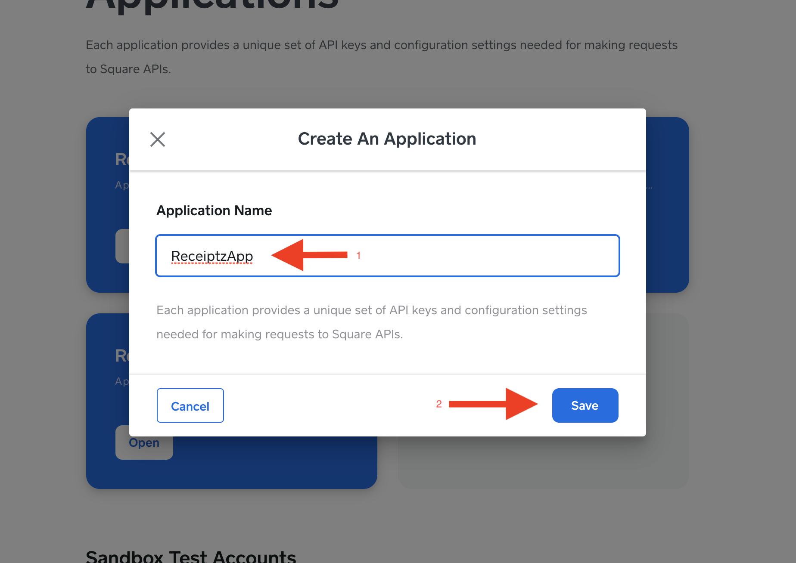
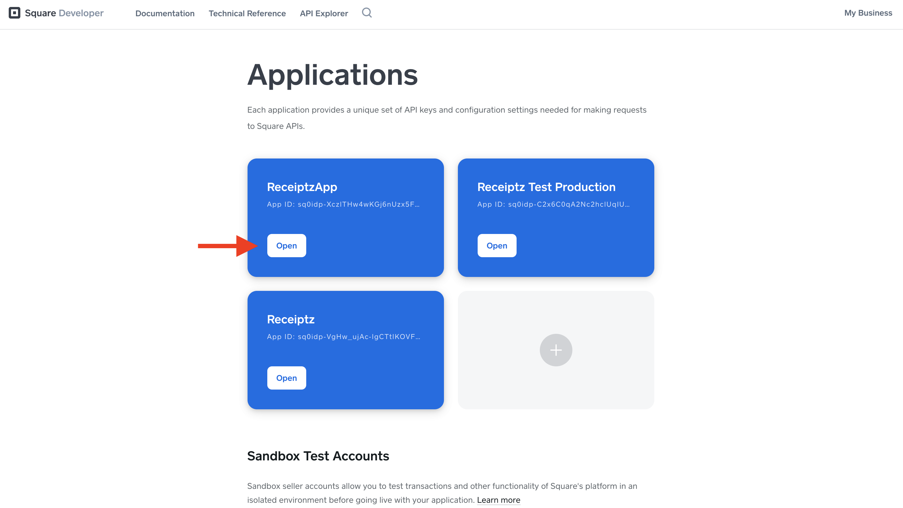

# Process of having a merchant give Receiptz an Oauth Token

In order for a merchant to give us approval to access information from about their customers, receipt information, order information and payment information, there are a few steps. These are all required in order for our process to work properly. By requesting the merchants' customer's payment information, we are able to cross reference a few criteria with our Receiptz app user's information. Specifically what we will be accessing is this group of of data:

```
"card": {
  "card_brand": "MASTERCARD",
  "last_4": "0456",
  "exp_month": 8,
  "exp_year": 2022,
  "fingerprint": "sq-1-BIU6TBHmPTXkT9sLQpW2W6i513iLLeehcRoeYQYUR-L5qqjQFQ0hz7AETeo3qA1cLw",
  "card_type": "CREDIT",
  "prepaid_type": "NOT_PREPAID",
  "bin": "519955"
},
```

With this object, we will cross check this information, with information about our users, in our user database. If there is a match, we will make another API request on behalf of the merchant, using the Oauth token that the merchant will be able to provide us.

## How to retrieve an Oauth token

### Step 1 - The merchant signs into their square developer portal

Have the merchant sign into their [square developer portal](https://squareup.com/login?app=developer&return_to=https://developer.squareup.com/apps) by using their merchant login credentials.

### Step 2 - The Merchant should add an Application called "ReceiptzApp"

After being signed in, click on the plus button under "Applications".


Type in "ReceiptzApp" into the input field. Then click save.



### Step 3 - Open up the ReceiptzApp Application

At this point, the merchant will go into the ReceiptzApp Application.



### Step 4 - Head into the Oauth Production section.

From there, click on "production", and then click on "Oauth".


### Step 5 - Fill in criteria and and create authorization code.

Type into the Production Redirect URL section: http://receiptzapp.com. Then click save.


### Step 6 - Create an Authorization Code and set permissions.

#### Part 1

In order to create the Oauth token we need an Authorization Code first. In order to create an Authorization Code, the merchant will open up another browser and type the URL into the browser.

`https://connect.squareup.com/oauth2/authorize?client_id={APPLICATION_ID}&scope=MERCHANT_PROFILE_READ+PAYMENTS_READ+CUSTOMERS_READ+ORDERS_READ`

The part that says `{APPLICATION_ID}` is going to be replaced with the ReceiptzApp application id. You can find that on the Oauth page in the picture above, labeled under `"Production Application ID"`, directly under `"Production Redirect URL"`.

The part of the url that says `MERCHANT_PROFILE_READ+PAYMENTS_READ+CUSTOMERS_READ+ORDERS_READ` is the set of permissions we will be accessing from the merchant data. We need to be have those permissions enabled for this Receiptz to work.

#### Part 2

Now that the merchant just went to the webpage above, take a look at the URL. You should see something like this:

`https://receiptzapp.com/?code=sq0cgp-acwU1y8hUJpd2YuCBQ_fjw&response_type=code#_=_`

Keep this on hand! The part of the URL to the right of `https://receiptzapp.com/?code=` and to the left of `&response_type=code#_=_` is the authorization token.

### Step 7 - use the Authrization Code, client_id, and client_secret to create a refresh_token and access_token (Oauth Token).

Because of the fact that Oauth tokens expire every 30 days, we need a refresh token. This refresh token allows us to get a new Oauth token every 30 days when they expire. The merchant will head to our bearer token creation url endpoint. They will enter 3 fields:

Client ID:
Client Secret:
Authorization Code:

Internally, we will run a POST request that looks like this when the submit button is pressed:
`https://connect.squareup.com/oauth2/token?client_id=sq0idp-C2x6C0qA2Nc2hclUqIUnPw&client_secret=sq0csp-S7hrVTPAay7EnNiFbxsZvh3881KK2CEsU1NJG7Rcs1s&grant_type=authorization_code&code=sq0cgp-rluyM1a-PcYv5jPd_znPaQ`

The output will look something like this:

```
{
  "access_token": "EAAAEGQk5cfU_hODcAfDZvr1pEOY3yB3clV_SBSKq5bvX_kLJ6TNZm2uRuu2Ub61",
  "token_type": "bearer",
  "expires_at": "2021-03-12T23:33:41Z",
  "merchant_id": "ML1JJ9DG73WYJ",
  "refresh_token": "EQAAEPhAcT3ltzzzkGSW2sr9fTRGB1RuS31ag131Jcw6vkqb5lIn807-EkFNcTew",
  "short_lived": false
}
```

The `access_token` is our Oauth token for the next 30 days. The `refresh_token` is our token which we will use to create a new Oauth token every 30 days to continue having access to the merchant data allowed above.

We can use this access token (Oauth token) to continually provide our users with digital receiptz.

<!-- WE NEED TO CREATE A LANDING PAGE FOR MERCHANTS TO EASILY GO TO AND PUT IN THE INFORMATION ABOVE (CLIENT ID, CLIENT SECRET, AND AUTHORIZATION CODE. THIS LANDING PAGE WILL GIVE RUN A POST OPERATION AND RETURN A BODY CONTAINING SOMETHING LIKE THIS:

{
  "access_token": "EAAAEGQk5cfU_hODcAfDZvr1pEOY3yB3clV_SBSKq5bvX_kLJ6TNZm2uRuu2Ub61",
  "token_type": "bearer",
  "expires_at": "2021-03-12T23:33:41Z",
  "merchant_id": "ML1JJ9DG73WYJ",
  "refresh_token": "EQAAEPhAcT3ltzzzkGSW2sr9fTRGB1RuS31ag131Jcw6vkqb5lIn807-EkFNcTew",
  "short_lived": false
}


THIS BODY WILL GIVE US OUR REFRESH TOKEN THAT WE WILL NEED FOREVER FOR THAT SPECIFIC MERCHANT.
) -->
